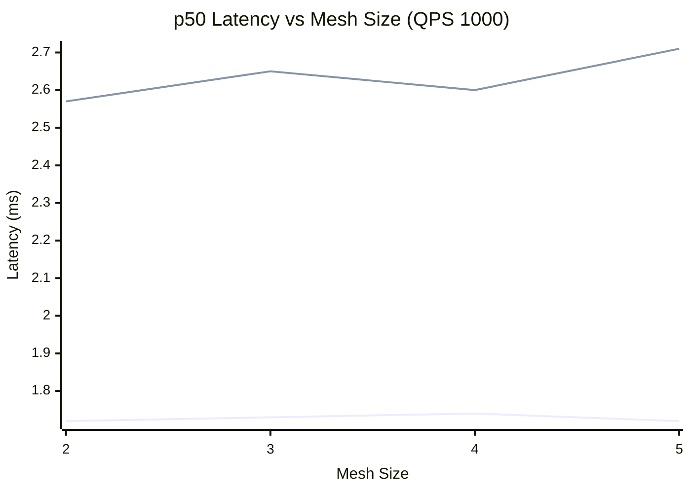
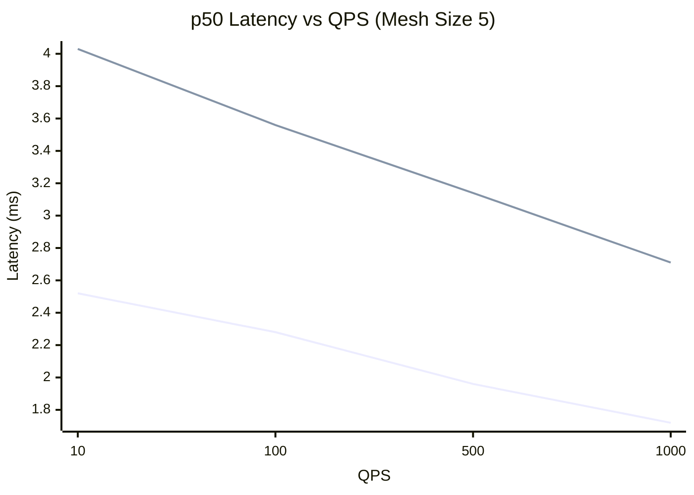

# Data-Plane Latency — Charts

```mermaid
xychart-beta
    title "p50 Latency vs Mesh Size (QPS 1000)"
    x-axis "Mesh Size" [2, 3, 4, 5]
    y-axis "Latency (ms)"
    line [1.72, 1.73, 1.74, 1.72]
    line [2.57, 2.65, 2.60, 2.71]
```

> Series order: **local**, **remote**. The gap is the cross-cluster overhead.

```mermaid
xychart-beta
    title "p50 Latency vs QPS (Mesh Size 5)"
    x-axis "QPS" [10, 100, 500, 1000]
    y-axis "Latency (ms)"
    line [2.52, 2.28, 1.96, 1.72]
    line [4.03, 3.56, 3.14, 2.71]
```

> Series order: **local**, **remote** at mesh size 5.
