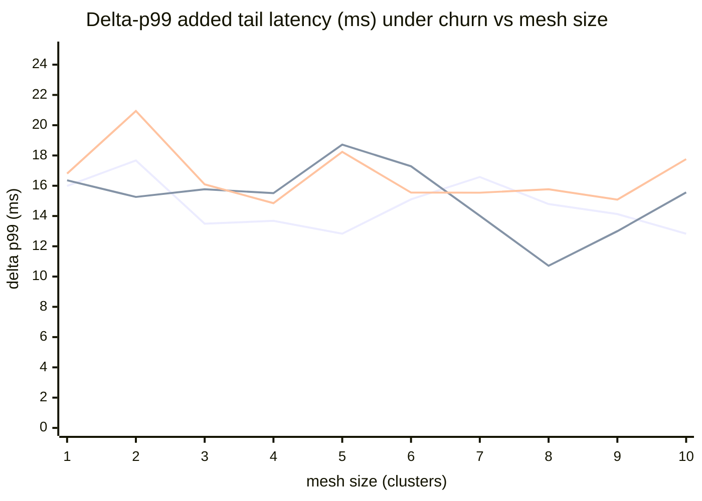
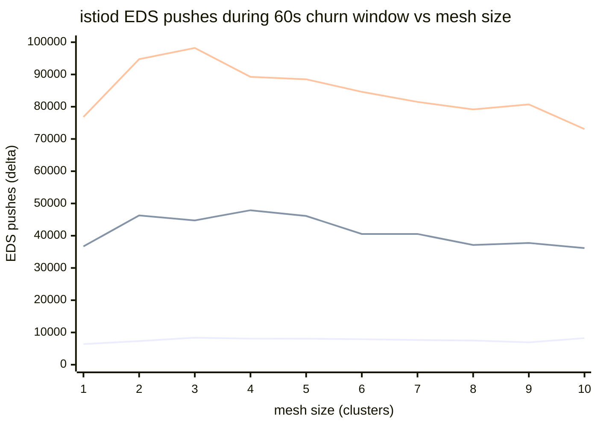

# Churn under data-plane load — charts (2026-06-04 clean pass)

Source: `tests/churn-dataplane/results/sweep-20260604T170554Z-2030208/sweep-summary-20260604T170554Z-2030208.md`
(sweep `20260604T170554Z-2030208`, the **clean re-run on the PR #50 fix**, mesh sizes 1→10 × churn rates 1/5/10 ops/s, QPS 200). Full 30/30 matrix, all `valid_runs = 1`. One sample per cell, so no error bars.

Δp99 = data-plane p99 *under churn* minus the steady-state baseline p99. EDS pushes = endpoint pushes istiod issued during the 60 s churn window. Values copied verbatim from the sweep summary.

| Mesh | Δp99 r1 | Δp99 r5 | Δp99 r10 | EDS r1 | EDS r5 | EDS r10 |
|---:|---:|---:|---:|---:|---:|---:|
| 1 | 15.99 | 16.36 | 16.80 | 6397 | 36680 | 76818 |
| 2 | 17.67 | 15.26 | 20.94 | 7327 | 46286 | 94748 |
| 3 | 13.49 | 15.77 | 16.09 | 8381 | 44749 | 98211 |
| 4 | 13.68 | 15.51 | 14.85 | 8075 | 47891 | 89248 |
| 5 | 12.83 | 18.72 | 18.24 | 8061 | 46119 | 88504 |
| 6 | 15.10 | 17.29 | 15.55 | 7909 | 40537 | 84614 |
| 7 | 16.58 | 14.02 | 15.54 | 7649 | 40547 | 81496 |
| 8 | 14.79 | 10.71 | 15.77 | 7507 | 37115 | 79166 |
| 9 | 14.13 | 13.00 | 15.08 | 6929 | 37755 | 80727 |
| 10 | 12.83 | 15.56 | 17.76 | 8240 | 36157 | 73073 |

## Added tail latency (Δp99) under churn vs mesh size

Line 1 = churn rate 1, line 2 = rate 5, line 3 = rate 10 (ops/s). Churn adds a **stable ~11–21 ms p99 tail that does not grow as the mesh scales 1→10**, and barely separates by churn rate — the control plane absorbs more churn without proportional data-plane impact.

## istiod EDS pushes during churn vs mesh size

Line 1 = rate 1, line 2 = rate 5, line 3 = rate 10. EDS push volume scales cleanly with **churn rate** (~7 k → ~42 k → ~85 k) and is roughly flat across mesh size — the push work tracks the churn, not the cluster count.

> **Read:** the headline result of the re-run suite — **churn's data-plane cost (~13–21 ms added p99) is flat across mesh size and only weakly sensitive to churn rate**, while istiod's push volume scales with the churn rate as expected. This clean 30/30 matrix was produced *despite* 6 namespace-teardown `CLEANUP_TIMEOUT`s that the PR #50 fix absorbed with zero data loss.
