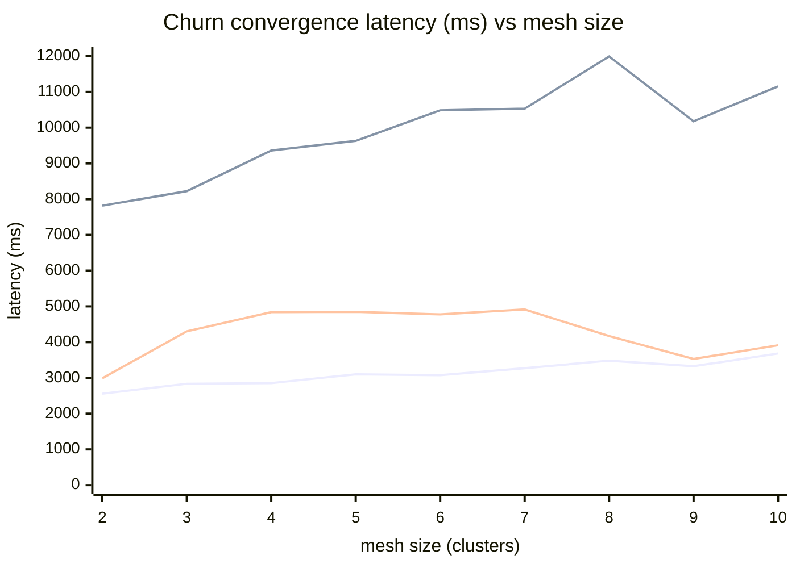
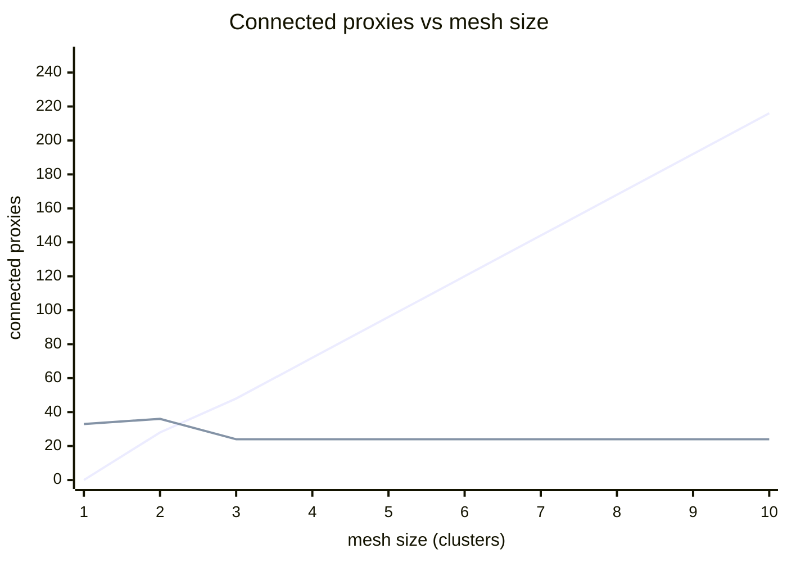

# Service/endpoint churn convergence — charts (2026-06-04 clean pass)

Source: `tests/churn/results/sweep-20260604T043213Z-1465754/sweep-20260604T043213Z-1465754.md`
(sweep `20260604T043213Z-1465754`, mesh sizes 1→10, churn intensity 5, scale 1→5, 5 iterations/size).

Values copied verbatim from the sweep summary. Remote-reach and remote-EDS have no value at mesh 1 (no remote cluster).

| Mesh | local conv avg (ms) | remote reach avg (ms) | remote EDS avg (ms) | src proxies | remote proxies | push amplification |
|---:|---:|---:|---:|---:|---:|---:|
| 1 | 2442 | — | — | 33 | 0 | 0.1 |
| 2 | 2558 | 7817 | 2989 | 36 | 28 | 0.5 |
| 3 | 2836 | 8224 | 4303 | 24 | 48 | 1.1 |
| 4 | 2855 | 9360 | 4839 | 24 | 72 | 0.8 |
| 5 | 3101 | 9629 | 4849 | 24 | 96 | 0.4 |
| 6 | 3077 | 10486 | 4775 | 24 | 120 | 0.5 |
| 7 | 3270 | 10531 | 4915 | 24 | 144 | 0.3 |
| 8 | 3483 | 11993 | 4172 | 24 | 168 | 0.4 |
| 9 | 3326 | 10179 | 3529 | 24 | 192 | 0.6 |
| 10 | 3682 | 11154 | 3913 | 24 | 216 | 0.3 |

## Convergence latency vs mesh size

Line 1 = local convergence, line 2 = remote reach (end-to-end), line 3 = remote istiod EDS. Local convergence creeps up gently (~2.4 → 3.7 s); remote reach plateaus ~8–12 s; remote-istiod EDS holds ~3–5 s. (x starts at mesh 2 where remote values exist; local at mesh 1 = 2442 ms is in the table.)

## Connected proxies vs mesh size

Remote connected proxies scale **linearly** with mesh size (~24 per added cluster → 216 at mesh 10), confirming correct full-mesh wiring; source proxies stay ~24–36. (Line 1 = remote proxies, line 2 = source proxies.)

> **Read:** convergence costs grow only gently with mesh size, remote proxy count scales linearly (the mesh is wiring up correctly), and **push amplification stays ≤ ~1.1** the whole way — no push storm. Queue-time p99 stayed in the `0-100 ms` bucket throughout.
