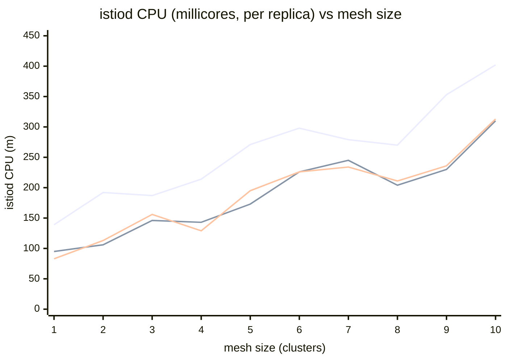
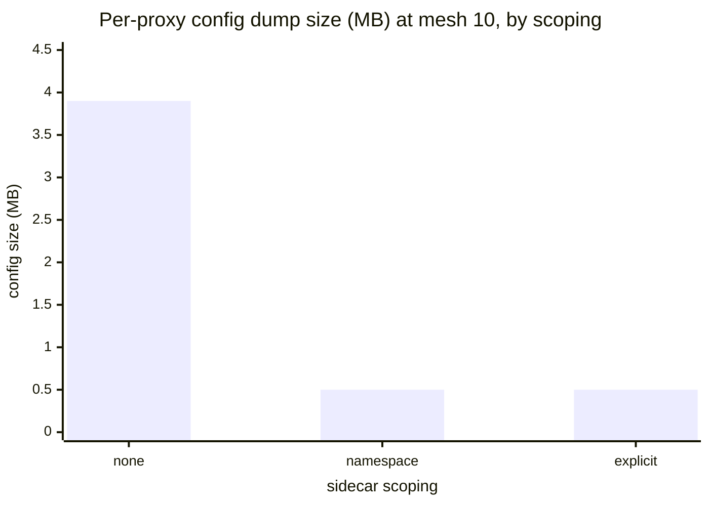

# Control-plane resource scaling — charts (2026-06-04 clean pass)

Source: `tests/controlplane/results/sweep-20260604T072535Z-51665/sweep-20260604T072535Z-51665.md`
(sweep `20260604T072535Z-51665`, mesh sizes 1→10 × sidecar scoping none/namespace/explicit, istiod 3 replicas, 10 services).

istiod CPU is the per-replica average in millicores; config size is the average per-proxy config dump in MB. Values copied verbatim from the sweep summary.

| Mesh | CPU none (m) | CPU ns (m) | CPU explicit (m) | cfg none (MB) | cfg ns/explicit (MB) |
|---:|---:|---:|---:|---:|---:|
| 1 | 139 | 95 | 83 | 3.8 | 0.4 |
| 2 | 192 | 106 | 113 | 3.8 | 0.4 |
| 3 | 187 | 146 | 156 | 3.8 | 0.4 |
| 4 | 214 | 143 | 129 | 3.8 | 0.4 |
| 5 | 271 | 173 | 195 | 3.8 | 0.5 |
| 6 | 298 | 226 | 226 | 3.8 | 0.5 |
| 7 | 279 | 245 | 234 | 3.8 | 0.5 |
| 8 | 270 | 204 | 211 | 3.9 | 0.5 |
| 9 | 353 | 230 | 236 | 3.9 | 0.5 |
| 10 | 402 | 310 | 313 | 3.9 | 0.5 |

## istiod CPU vs mesh size, by sidecar scoping

Line 1 = **none** (no Sidecar scoping), line 2 = **namespace**, line 3 = **explicit**. CPU rises with mesh size and is consistently highest with no scoping (402 m at mesh 10 vs ~310 m scoped). Even at mesh 10 the peak is ~0.4 cores against an 8-core-headroom node — the control plane is comfortable.

## Per-proxy config size by sidecar scoping (mesh 10)

Sidecar scoping cuts the per-proxy config push from **3.9 MB → 0.5 MB (~87%)** — the single biggest control-plane lever in the campaign. (The ratio is flat across mesh size: 87–89%.)

> **Read:** two findings. (1) istiod CPU scales gently and stays well within headroom even unscoped at mesh 10; **0 istiod restarts** across all 30 combos (the O5 CPU-request fix validated at full 10×3). (2) **Sidecar scoping is the high-value knob** — ~87% smaller per-proxy config and lower istiod CPU, with no downside observed. Memory stayed flat (~330–354 Mi) and heap-in-use ~108–187 Mi across all combos (not charted — no meaningful trend).
