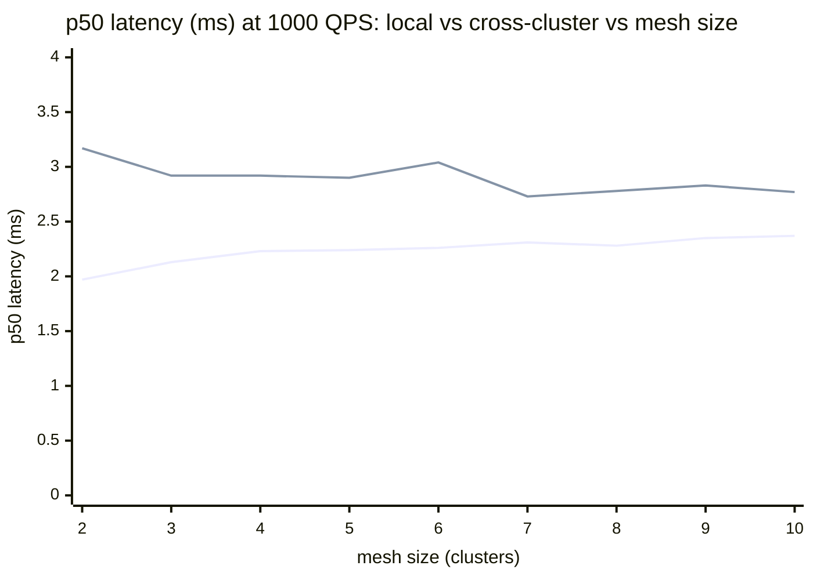
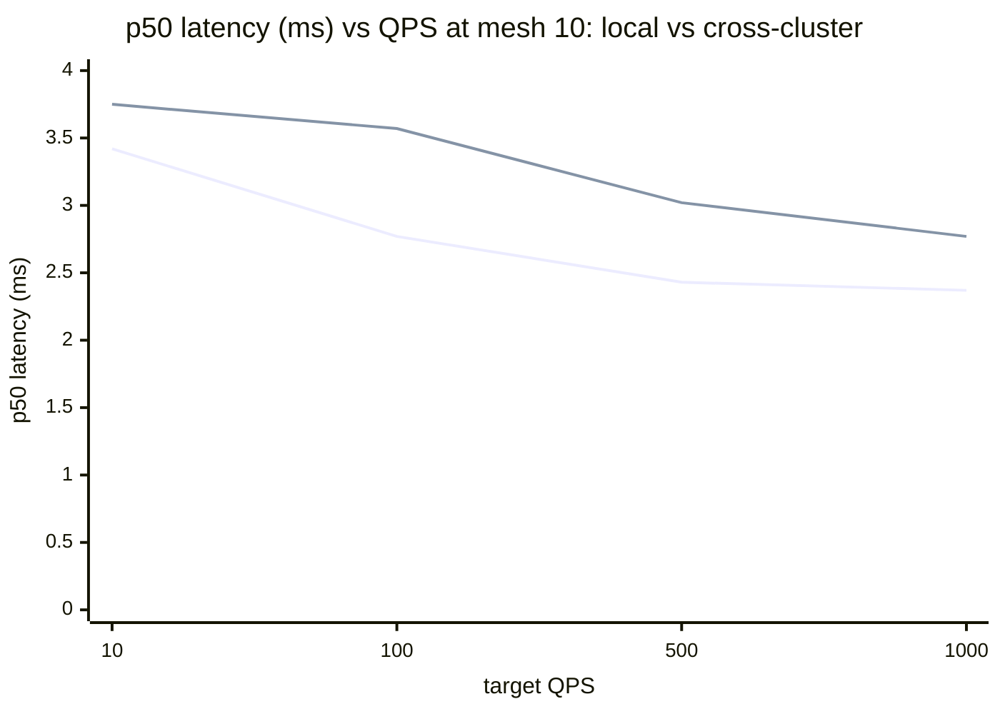

# Data-plane latency — charts (2026-06-04 clean pass)

Source: `tests/dataplane/results/sweep-20260604T114908Z-831116/sweep-20260604T114908Z-831116.md`
(sweep `20260604T114908Z-831116`, mesh sizes 1→10 × QPS 10/100/500/1000 × local/remote target, 8 connections). All combos achieved 100% success (`pct_200 = 1.0`). Note: one sample per cell, so single-point cells are noisy at low QPS; the trends across mesh/QPS are the signal.

## Local vs cross-cluster latency vs mesh size (at 1000 QPS)

Line 1 = **local** target, line 2 = **remote** (cross-cluster) target, p50 ms. The gap between the lines **is** the cross-cluster overhead — ~0.4–1.2 ms — and it does not grow with mesh size. (Remote exists from mesh 2; local at mesh 1 = 2.09 ms.)

| Mesh | local p50 | remote p50 | local p99 | remote p99 |
|---:|---:|---:|---:|---:|
| 1 | 2.09 | — | 2.99 | — |
| 2 | 1.97 | 3.17 | 2.99 | 4.78 |
| 3 | 2.13 | 2.92 | 3.31 | 4.15 |
| 4 | 2.23 | 2.92 | 2.99 | 4.50 |
| 5 | 2.24 | 2.90 | 3.00 | 9.18 |
| 6 | 2.26 | 3.04 | 3.00 | 4.56 |
| 7 | 2.31 | 2.73 | 3.00 | 4.83 |
| 8 | 2.28 | 2.78 | 2.99 | 4.77 |
| 9 | 2.35 | 2.83 | 3.23 | 5.04 |
| 10 | 2.37 | 2.77 | 3.06 | 6.36 |

## Latency vs load (mesh 10): local vs cross-cluster

Line 1 = **local**, line 2 = **remote**, p50 ms across the QPS sweep at the full 10-cluster mesh. Latency *drops* as QPS rises (connection pools warm up); cross-cluster stays a fraction of a ms above local at every level.

| QPS | local p50 | remote p50 | local p99 | remote p99 |
|---:|---:|---:|---:|---:|
| 10 | 3.42 | 3.75 | 17.51\* | 6.98 |
| 100 | 2.77 | 3.57 | 4.61 | 6.10 |
| 500 | 2.43 | 3.02 | 5.79 | 5.65 |
| 1000 | 2.37 | 2.77 | 3.06 | 6.36 |

\* local p99 at 10 QPS is single-sample tail noise (n=1, ~300 requests).

> **Read:** cross-cluster routing adds only **~0.5–1 ms at p50**, flat across mesh size and load; p99 stays single-digit ms at scale. Every QPS level hit 100% success and full target throughput. The lone high local p99 (17.5 ms at 10 QPS, mesh 10) is small-sample tail noise, not a scaling effect.
