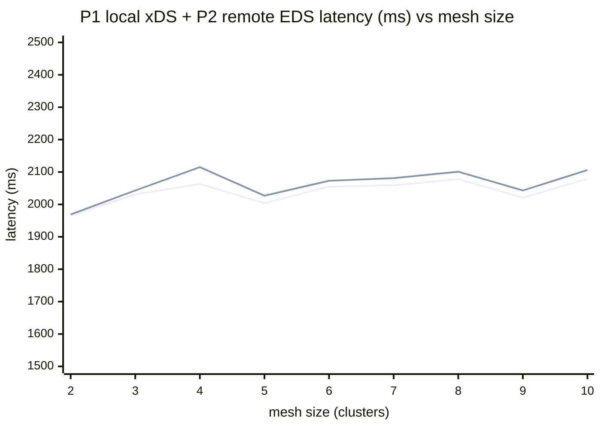
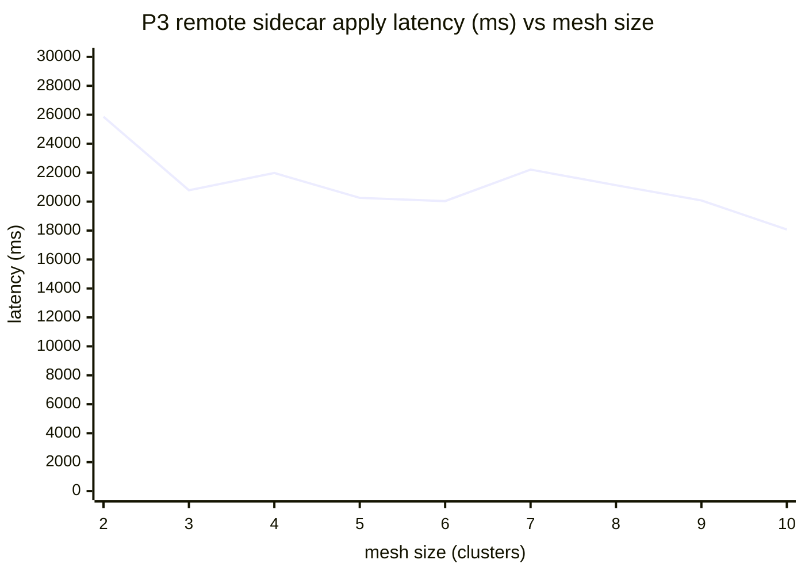

# Propagation — charts (2026-06-04 clean pass)

Source: `tests/propagation/results/sweep-20260604T024318Z-1085945/sweep-summary.md`
(sweep `20260604T024318Z-1085945`, Istio v1.28.5, mesh sizes 1→10, 10 iterations/size).

Values are the harness's per-mesh-size **averages over valid iterations**, copied verbatim from the sweep summary's "Comparison across mesh sizes" table. P2/P3 have no value at mesh size 1 (a single cluster has no remote to propagate to).

| Mesh | P1 local xDS wall (ms) | P2 remote istiod EDS (ms) | P3 remote sidecar apply (ms) |
|---:|---:|---:|---:|
| 1 | 2038 | — | — |
| 2 | 1965 | 1969 | 25860 |
| 3 | 2031 | 2043 | 20786 |
| 4 | 2063 | 2115 | 21976 |
| 5 | 2004 | 2027 | 20257 |
| 6 | 2055 | 2073 | 20036 |
| 7 | 2059 | 2081 | 22212 |
| 8 | 2078 | 2101 | 21133 |
| 9 | 2021 | 2043 | 20079 |
| 10 | 2079 | 2106 | 18071 |

## P1 local push + P2 remote istiod EDS vs mesh size

Both are flat at ~2.0–2.1 s across the whole range — local xDS push and remote-istiod EDS propagation **do not degrade as the mesh scales 1→10**. (Line 1 = P1 local xDS wall; line 2 = P2 remote istiod EDS. P1 at mesh 1 = 2038 ms, in the table above.)

## P3 remote sidecar apply vs mesh size

The dominant propagation cost: applying the new endpoint at the **remote sidecars** takes ~13–26 s (averaged) and is high-variance per remote cluster — this is the real scaling signal, an order of magnitude above P1/P2, and it does **not** trend upward with mesh size (if anything it is flat-to-slightly-down).

> **Read:** the headline is the **two-orders-of-magnitude gap** between control-plane push (P1/P2 ~2 s) and full data-plane convergence at remote sidecars (P3 ~20 s). Neither degrades with mesh size at this scale. The convergence-histogram quantiles (`conv_p50/p99`) are **not** charted — they were starved below their min-sample floor in this lightly-loaded run (default 1 watcher replica) and carry no plottable values.
