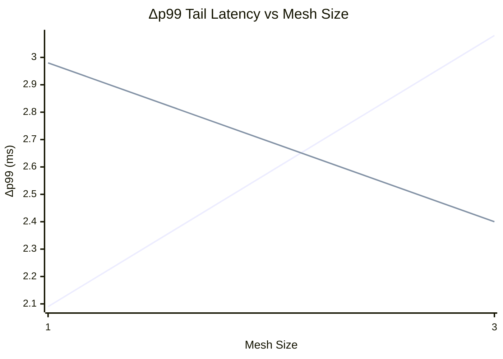
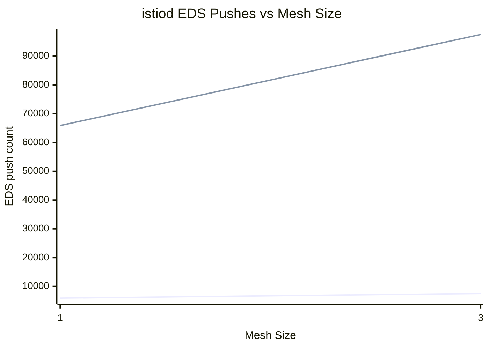

---
## RUN_ID=20260617T140548Z-539439
## HARNESS_SHA=0461af1-dirty
## ISTIO_VERSION=v1.28.5
## KUBE_VERSIONS=cluster-002=v1.34.6,cluster-003=v1.34.6,cluster-004=v1.34.6
## TUNING_BASELINE=sidecar=on,discoverySelectors=on,telemetryFiltering=on,accessLogFiltering=on
## SIDECAR_EGRESS_HOSTS=./* istio-system/* mesh-verify/* churn-test/* churn-dataplane-test/* controlplane-test/* dataplane-test/* propagation-test/*
## ISTIOD_REPLICAS=unknown
## SETTLE_SEC=10
## BASELINE_DURATION_SEC=60
## CHURN_DURATION_SEC=60
## QPS=200
## CONNECTIONS=8
## NAMESPACE=churn-dataplane-test
## FANOUT_MAX_SKEW_MS=unknown
## FANOUT_METRICS_TIMEOUT=unknown
generated: 2026-06-17T15:01:21+00:00
---

# Churn x Data-Plane — Charts

% Chart 1: delta-p99 added tail latency (ms) under churn vs mesh size
% Series order (by churn rate): 1 10

> Series order (by churn rate): **1** **10**. Expected: ~flat across mesh size.

% Chart 2: istiod EDS pushes during churn vs mesh size

> Series order (by churn rate): **1** **10**. Expected: scales with churn rate, ~flat across mesh size.
