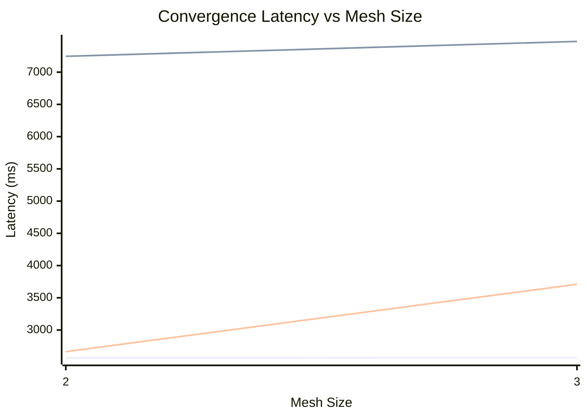
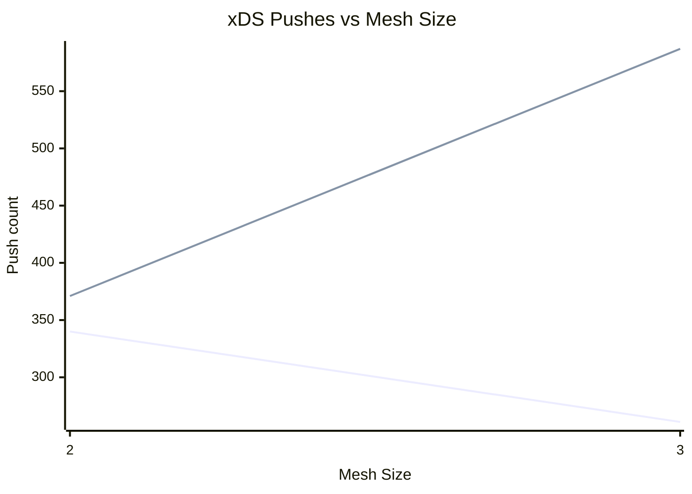
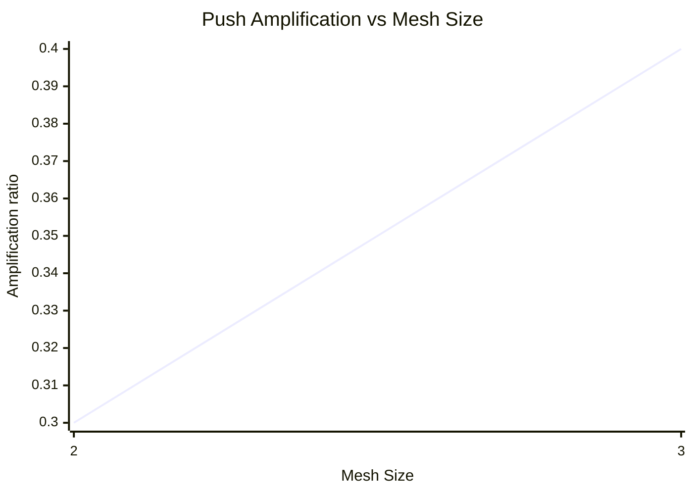

# Churn Convergence — Charts

% Chart 1: Convergence latency (ms) vs mesh size
% Series order: local avg, remote reach avg, remote EDS avg
% x-axis starts at mesh 2 (remote series undefined at mesh 1)

> Series order: **local avg**, **remote reach avg**, **remote EDS avg**.
> x-axis starts at mesh 2 — remote metrics are undefined at mesh size 1.

% Chart 2: xDS pushes vs mesh size
% Series order: source xDS pushes, remote xDS pushes

> Series order: **source xDS pushes**, **remote xDS pushes**.

% Chart 3: Push amplification ratio vs mesh size

> Series: **push amplification ratio** (total xDS pushes / source push triggers). Expected <= ~1.
