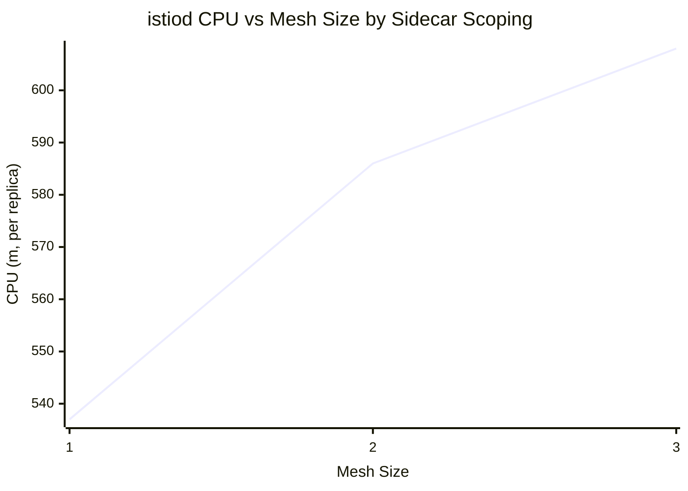
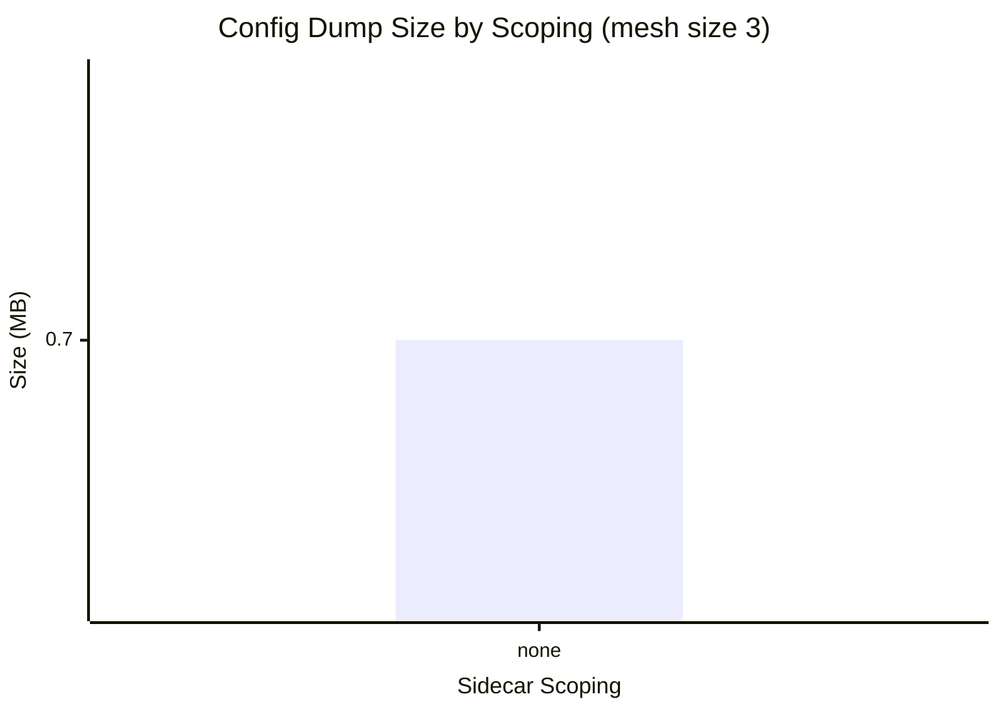

# Control-Plane Resource Scaling — Charts

% Chart 1: istiod CPU (m, per replica) vs mesh size, by sidecar scoping
% Series order: none

> Series order: **none**.

% Chart 2: Per-proxy config dump size (MB) by scoping at mesh size 3

> Config dump avg (MB) at the largest mesh size swept (3).
