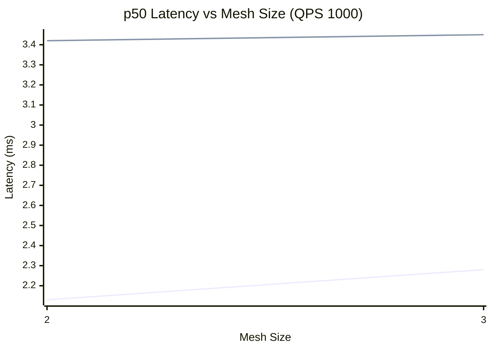
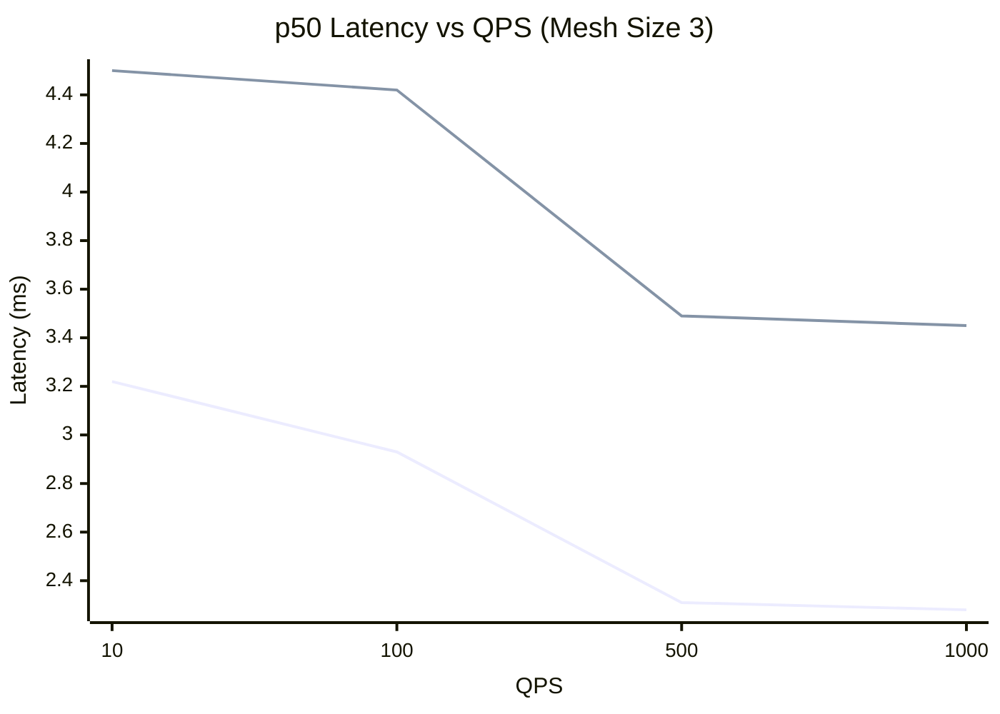

# Data-Plane Latency — Charts

% Chart 1: p50 latency (ms) vs mesh size at QPS 1000
% Series order: local, remote
% x-axis starts at mesh 2 (remote undefined at mesh 1)

> Series order: **local**, **remote**. The gap = cross-cluster overhead.

% Chart 2: p50 latency (ms) vs QPS at mesh size 3

> Series order: **local**, **remote** at mesh size 3.
