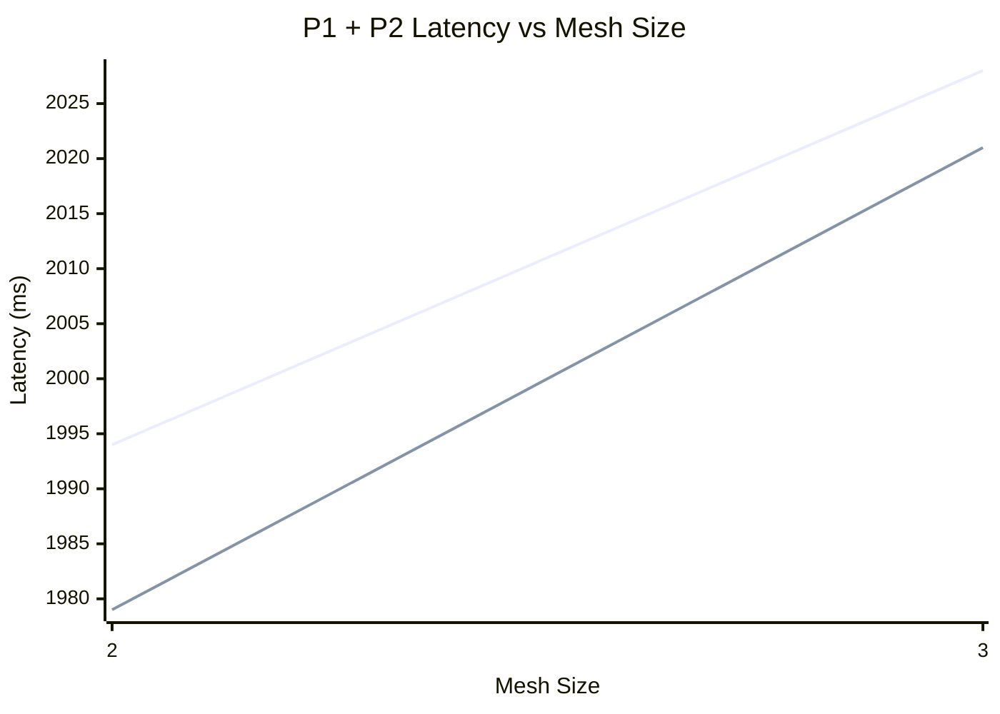
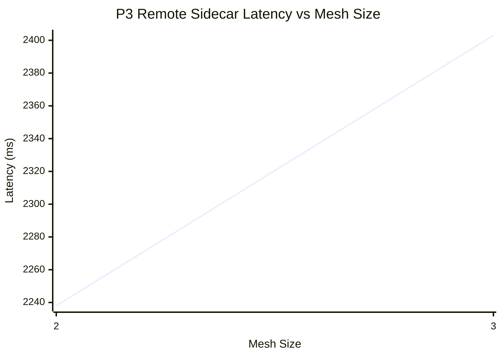

# Endpoint Propagation Latency — Charts

% Chart 1: P1 local xDS + P2 remote istiod EDS latency
% Series order: P1 wall avg (ms), P2 EDS avg (ms)
% x-axis starts at mesh 2 (P2 undefined at mesh 1)

> Series order: **P1 wall avg** (ms), **P2 EDS avg** (ms).
> x-axis starts at mesh 2 — P2 is undefined at mesh size 1 (no remote cluster).

% Chart 2: P3 remote sidecar apply latency
% Series: P3 sidecar avg (ms)

> Series: **P3 sidecar avg** (ms). Separate chart — P3 is typically ~10x P1/P2 scale.
