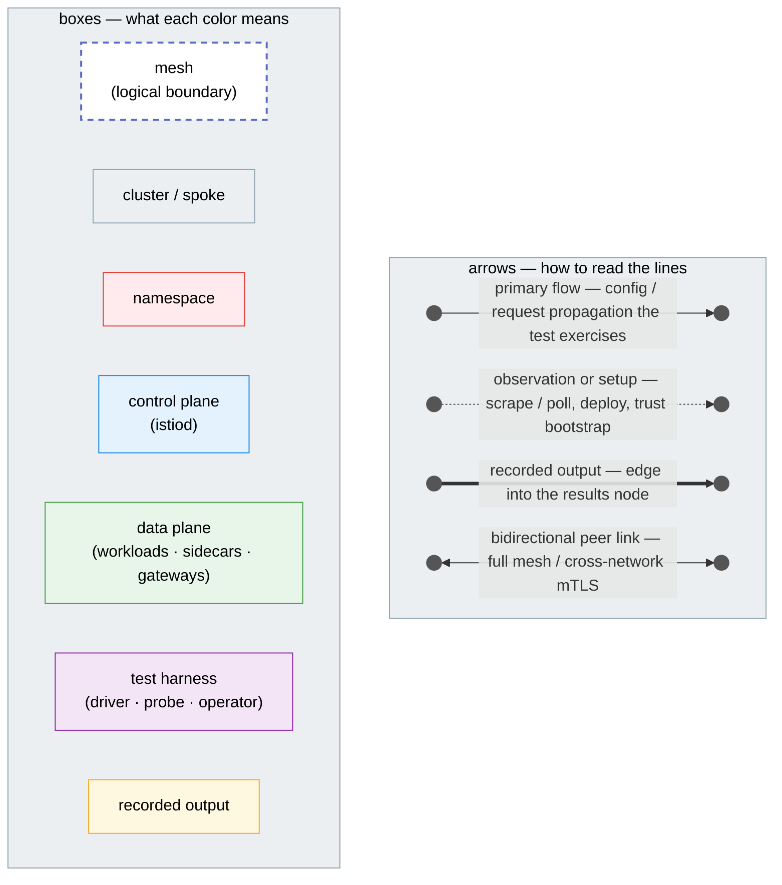
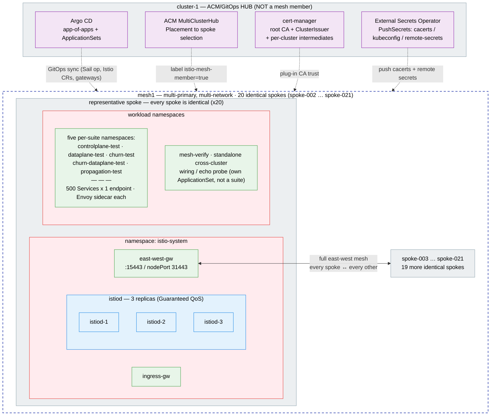

# Scale-test campaign — architecture diagrams

These diagrams show the **shape** of the test bed: an ACM/GitOps hub (outside the mesh)
driving `N` spoke clusters joined into one multi-primary, multi-network Istio mesh
(`mesh1`). The high-level topology is here; each measurement suite's own harness diagram
lives in its `tests/<suite>/README.md` (linked under [Per-suite diagrams](#per-suite-test-harness-diagrams)).

The topology is identical at any size; only the spoke count and per-spoke workload change.
The diagrams below are parameterized for an illustrative **20-spoke × 500-services-per-spoke
(= 10,000 services)** run. The naming follows the repo convention — the hub is `cluster-1`
and the mesh members are `spoke-002 … spoke-021` (as in the `rosa-002…` contexts from the
2026-06-04 clean pass).

> These numbers are a parameterization, not a logged result. The recorded passes in
> [`docs/campaigns/`](../campaigns/) are the **10-spoke** clean pass (100 services) and the
> **500-spoke** target profile in [`README.md`](./README.md). Trust the *shapes* and
> *cross-cluster overheads*, not these absolute magnitudes.

## Diagram conventions

Every diagram in this campaign — the topology below **and** the per-suite harness diagrams
in each `tests/<suite>/README.md` — uses this one legend. Arrow styles and box colors always
mean the same thing regardless of which suite they appear in (e.g. a namespace is always a
red box), so the diagrams read as one consistent system.



- **Arrows** — solid = primary flow (config / request propagation the test exercises);
  dotted = observation or setup (scrape / poll, deploy, trust bootstrap); bold = recorded
  output (edge into a results node); double-headed = bidirectional peer link (full mesh /
  cross-network mTLS).
- **Box colors** — dashed indigo = mesh (logical boundary); gray = cluster / spoke; red =
  namespace; blue = control plane (istiod); green = data plane (workloads / sidecars /
  gateways); purple = test harness (driver / probe / operator); amber = recorded output.

## Overall architecture



- The **hub** (`cluster-1`) is GitOps/ACM control infrastructure only — never labeled
  `istio-mesh-member=true`, never a mesh member.
- Every spoke is identical, so only one is drawn in full: **istiod at 3 replicas** plus the
  east-west and ingress gateways in `istio-system`, and its workloads in per-suite namespaces
  (`controlplane-test`, `dataplane-test`, …). `mesh-verify` is a standalone cross-cluster
  wiring / echo probe with its own ApplicationSet — **not** one of the five suites.
- **East-west is full mesh** — every spoke reaches every other spoke's east-west gateway
  (the one labeled edge stands in for all 20 × 19 cross-network paths).

## Per-suite test-harness diagrams

Each suite's measurement mechanism is drawn in its own README, using the same
[legend](#diagram-conventions) as above:

- **Control-plane** — istiod CPU/mem/xDS vs mesh size, 3-phase delta window —
  [`tests/controlplane/README.md`](../../tests/controlplane/README.md#architecture)
- **Data-plane** — cross-cluster latency/QPS through the east-west gateways —
  [`tests/dataplane/README.md`](../../tests/dataplane/README.md#architecture)
- **Propagation** — config-change freshness (P1 → P2 → P3) —
  [`tests/propagation/README.md`](../../tests/propagation/README.md#architecture)
- **Churn** — control-plane convergence + push amplification under endpoint churn —
  [`tests/churn/README.md`](../../tests/churn/README.md#architecture)
- **Churn × data-plane** — p99 degradation while istiod is busy with churn —
  [`tests/churn-dataplane/README.md`](../../tests/churn-dataplane/README.md#architecture)

> Source for every diagram is the inline ` ```mermaid ` block — GitHub renders them
> natively. To rasterize one, copy its block into a `<name>.mmd` file and run
> `mmdc -i <name>.mmd -o <name>.png -b white`.
