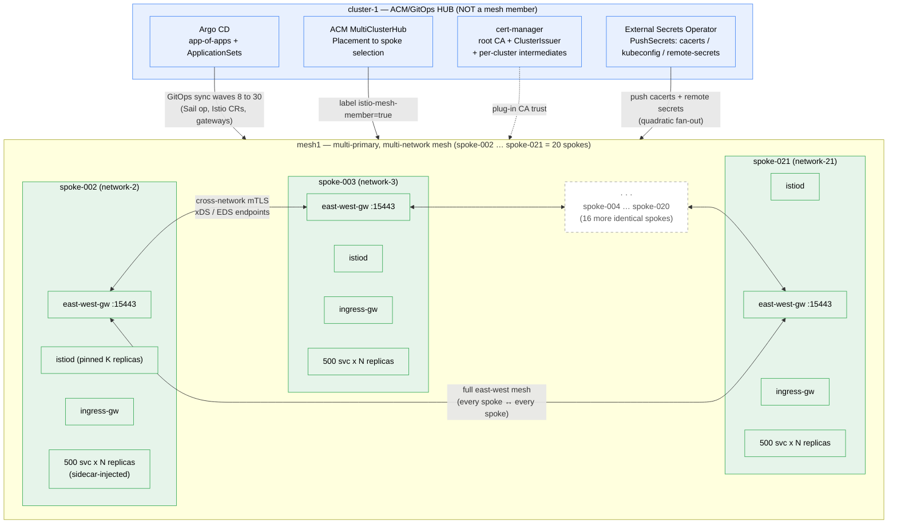
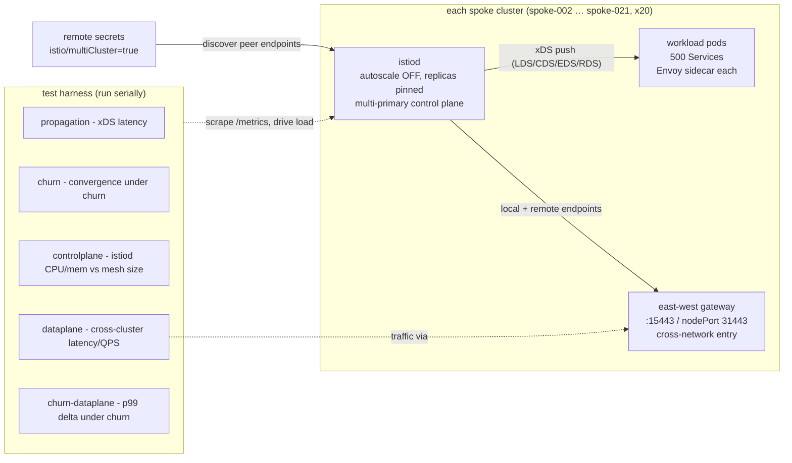

# Scale-test campaign — architecture diagrams

These diagrams show the **shape** of the test bed: an ACM/GitOps hub (outside the mesh)
driving `N` spoke clusters joined into one multi-primary, multi-network Istio mesh
(`mesh1`), plus the per-spoke internals the five test suites measure.

The topology is identical at any size; only the spoke count and per-spoke workload change.
The diagrams below are parameterized for an illustrative **20-spoke × 500-services-per-spoke
(= 10,000 services)** run. The naming follows the repo convention — the hub is `cluster-1`
and the mesh members are `spoke-002 … spoke-021` (as in the `rosa-002…` contexts from the
2026-06-04 clean pass).

> These numbers are a parameterization, not a logged result. The recorded passes in
> [`docs/campaigns/`](../campaigns/) are the **10-spoke** clean pass (100 services) and the
> **500-spoke** target profile in [`README.md`](./README.md). Trust the *shapes* and
> *cross-cluster overheads*, not these absolute magnitudes.

## Overall architecture



- The **hub** (`cluster-1`) is GitOps/ACM control infrastructure only — never labeled
  `istio-mesh-member=true`, never a mesh member.
- Each **spoke** is its own network with its own istiod (multi-primary), an east-west
  gateway (`:15443`, or nodePort `31443`), an ingress gateway, and its sidecar-injected
  workload.
- **East-west is full mesh** — every spoke reaches every other spoke's east-west gateway.
  The chain is drawn through the `· · ·` continuation node to imply all 20 spokes.

## Per-spoke internals + test harness



- istiod (autoscale off, pinned replica count — required for measurement fidelity) pushes
  xDS to the local sidecars and programs the east-west gateway with local + remote endpoints.
- Remote secrets (`istio/multiCluster=true`) give istiod its view of peer-cluster endpoints.
- The five suites run **serially** against the same istiod (concurrent runs contaminate each
  other's xDS counters/histograms/CPU), scraping `/metrics` and driving load through the
  east-west gateway.

> Source for these diagrams is inline above — GitHub renders the ` ```mermaid ` blocks
> natively. To regenerate PNGs locally: `mmdc -i <file>.mmd -o <file>.png -b white`.
