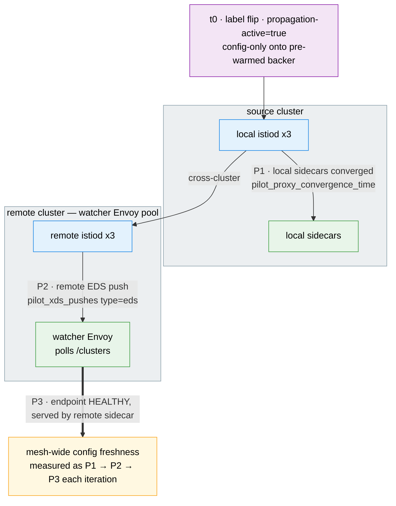

# Propagation Latency Test Suite

Automated measurement of how quickly Istio's multi-cluster control plane propagates endpoint changes across clusters.

## Architecture

> Diagram conventions (arrow styles, box colors) are shared across all suites — see
> [`docs/scale-test-campaign/architecture.md`](../../docs/scale-test-campaign/architecture.md#diagram-conventions).



## What Gets Measured

### Endpoint Propagation (002)

| Phase | What | How |
|-------|------|-----|
| P1 | Local istiod pushes xDS to local sidecars | Delta of `pilot_proxy_convergence_time` histogram on source istiod (converged when delta `_count` reaches connected proxy count). Reports both wall-clock detection time and delta-window p50/p99 of the histogram itself. |
| P2 | Remote istiod discovers new endpoints | Delta of `pilot_xds_pushes{type="eds"}` counter on each remote istiod. First non-zero delta = remote learned about the new endpoint and pushed EDS (`p2_ms` is stamped here). The bump is flagged `p2_dirty=1` when the canary did **not** become `health_flags::healthy` on that remote's watcher within the window (i.e. P3 did not succeed) — reconciled against P3's outcome, since otherwise the bump could be unrelated endpoint churn. |
| P3 | Remote sidecar has HEALTHY endpoints | Watcher pod's Envoy admin `/clusters` polled at >= 1 Hz (the only data-plane-side signal without a custom xDS client). |

In multi-primary Istio, only endpoints propagate cross-cluster. VirtualService and DestinationRule are local config processed only by the istiod that owns the namespace.

### t0 is a config-only label flip onto a pre-warmed backer (O1)

Earlier the probe created a **fresh** `propagation-canary` Deployment + Service at `t0` every iteration, so `P3`'s clock included pod scheduling, image pull (`http-echo:latest`, no readiness probe), and sidecar startup — `P3` ran 8–102 s and was non-monotonic, measuring "new workload reachable" rather than xDS propagation.

Now `001-setup` pre-warms a single **backer** pod (`propagation-canary` Deployment, image pinned + `imagePullPolicy: IfNotPresent`, sidecar up, `readinessProbe`) and creates the canary Service. The Service selects on `app=propagation-canary` **AND** an active-flip label (`propagation-active: "true"`), so it has **zero endpoints** while the backer is Ready-but-not-selected. At `t0` the probe captures the backer pod, sets `T0`, then stamps `propagation-active=true` onto the running pod (config-only `kubectl label`, no reschedule). The Service endpoint appears immediately and all three phases share one `T0`, so `P3` collapses toward `P1`/`P2` + EDS delivery. Drain flips the label off (`propagation-active-`); the backer stays warm for the next iteration. The Deployment/Service persist across iterations and are removed by `007-cleanup`.

Because the Service persists, the `propagation-canary` **cluster** entry stays in the watcher Envoy's `/clusters` after drain — "drained" means no `health_flags::healthy` endpoint for it (the exact inverse of P3 detection), not the cluster name disappearing.

### Why histogram-based P1 (not /debug/syncz)

`/debug/syncz` and `/debug/endpointz` serialize the full push context (or endpoint catalogue) per request — at hundreds of services and many clusters that is hundreds of MB of JSON and seconds of CPU per poll. The probe ends up competing with the work it's measuring; the recorded timestamp reflects when istiod could finally serve the debug endpoint, not when convergence happened.

`pilot_proxy_convergence_time` is the same histogram that the repo's `charts/istiod-monitor/templates/prometheusrule.yaml` aggregates into `pilot:proxy_convergence_time:p99_5m`. It records one sample per push-ACK. The probe captures a snapshot of `_bucket`/`_sum`/`_count` before the canary apply, then polls until the delta `_count` reaches `proxy_count` (each connected proxy has received at least one push). `pilot_xds_pushes{type="eds"}` is already per-proxy, so the threshold is simply the connected proxy count.

### Multi-replica istiod fanout

A single `kubectl port-forward svc/istiod` load-balances to one random replica per connection, so at multi-replica istiod a lone scrape sees only `~1/replicas` of the connected proxies, pushes, and convergence samples — and baseline/final snapshots can land on different pods. The probe instead **fans out**: it port-forwards EVERY Running istiod pod per context (via `tests/lib/fanout.sh`) and aggregates the per-pod scrapes with the correct semantics:

- `pilot_xds` (connected proxies) — **summed** across replicas (each proxy is one istiod connection); this is `proxy_count`.
- `pilot_services` (mesh-global registry) — **replica-invariant**, reduced with max/any across pods, never summed.
- `pilot_proxy_convergence_time` / `pilot_xds_pushes{type="eds"}` / `pilot_services` — histogram buckets and counters summed across pods, then delta'd.
- P1 convergence (mesh-wide, PL20): converged when `Σ delta _count across source pods >= Σ pilot_xds across source pods`.
- Restart detection (PL9, widened): any pod's `process_start_time_seconds` advancing OR a pod-set change flips the per-pod start signature → `restarted=1`.

The probe requires only `>= 1` Running istiod pod per context (it no longer dies on `> 1`) and records the per-context replica counts in the TSV preamble as `# ISTIOD_REPLICAS=ctx=N,...`. The P3 watcher-Envoy path (data-plane side) is unchanged.

## Prerequisites

- `oc` or `kubectl`, `helm`, `jq`, `curl`, `awk`
- Multi-primary mesh deployed (see root README)
- Kube contexts configured for each cluster

## Quick Start

```bash
# 1. Setup watcher pods on all clusters
#    Use --watcher-replicas to scale up for histogram quantile extraction
#    (p50 needs >= 10 connected proxies, p99 needs >= 30).
./tests/propagation/001-setup-propagation-test.sh --contexts cluster-001,cluster-002,cluster-003 \
  --watcher-replicas 30

# 2. Run endpoint probe (2-cluster)
./tests/propagation/002-run-endpoint-probe.sh \
  --source-context cluster-001 --remote-contexts cluster-002 \
  --iterations 10 --tsv

# 3. View results
./tests/propagation/005-report-results.sh
```

## Sweep Across Mesh Sizes

Compare propagation latency at different cluster counts:

```bash
# Run probes at mesh_size=1, 2, 3 with 30 watcher replicas for histogram quantiles
./tests/propagation/006-run-sweep.sh \
  --contexts cluster-001,cluster-002,cluster-003 \
  --mesh-sizes 1,2,3 \
  --iterations 5 --tsv --watcher-replicas 30

# Dry-run prints the planned matrix to stderr without touching clusters
./tests/propagation/006-run-sweep.sh \
  --contexts cluster-001,cluster-002,cluster-003 \
  --mesh-sizes 1,2,3 --dry-run
```

Each sweep writes into `tests/propagation/results/sweep-${RUN_ID}/` so individual sweep runs are not interleaved with one another.

The sweep orchestrator:
1. Sets up watcher pods on clusters for each mesh size (forwarding `--watcher-replicas`)
2. Runs endpoint probe (002) at each size
3. Sleeps `--settle-sec` (default 5s) between mesh-size steps
4. Generates a comparison report grouped by mesh_size

## Passive Metrics Collection

### Via port-forward (004)

```bash
# One-shot snapshot
./tests/propagation/004-collect-pilot-metrics.sh --contexts cluster-001,cluster-002

# Watch mode during load test
./tests/propagation/004-collect-pilot-metrics.sh --watch --interval 10
```

### Via OpenShift User Workload Monitoring

Deploy the `istiod-monitor` chart on each spoke:

```bash
helm install istiod-monitor charts/istiod-monitor -n istio-system --context cluster-001
```

This creates a ServiceMonitor scraping istiod's `pilot_*` metrics. Query via thanos-querier:

```promql
histogram_quantile(0.99, rate(pilot_proxy_convergence_time_bucket[5m]))
```

## Results Format

TSV files in `tests/propagation/results/` (gitignored). Sweep runs use `tests/propagation/results/sweep-${RUN_ID}/`.

### TSV preamble

Each TSV begins with `# KEY=VALUE` comment lines:

```
# RUN_ID=20250520T101530-12345
# HARNESS_SHA=abc1234
# ISTIO_VERSION=v1.28.5
# KUBE_VERSIONS=cluster-001=v1.34.6,cluster-002=v1.34.6,cluster-003=unreachable
# SOURCE_CTX=cluster-001
# REMOTES=cluster-002 cluster-003
# MESH_SIZE=3
# ITERATIONS=10
# POLL_INTERVAL_S=0.250
# TIMEOUT_SEC=120
# SETTLE_SEC=5
# FANOUT_MAX_SKEW_MS=1000
# FANOUT_METRICS_TIMEOUT=30
# BACKER_IMAGE=hashicorp/http-echo:1.0
# DATE=2025-05-20T10:15:30+00:00
```

`FANOUT_MAX_SKEW_MS` and `FANOUT_METRICS_TIMEOUT` are both result-affecting (PL2):
the former decides which rows are tagged `SCRAPE_INCOMPLETE` and dropped by `005`;
the latter bounds the per-`/metrics` curl wait and therefore the worst-case skew
the gate can observe. `BACKER_IMAGE` records the pre-warmed workload image
(`hashicorp/http-echo:$HTTP_ECHO_VERSION`) so a row is self-describing. All three
are carried into the `005` report metadata (sweep-level scalars).

`KUBE_VERSIONS` is probed concurrently with `--request-timeout=5s`; unreachable contexts emit `unreachable`, contexts that respond without parseable version emit `unknown`.

### TSV columns

```
run_id  mesh_size  iteration  source_ctx  remote_ctx  t0_epoch_ns
p1_ms  p2_ms  p3_ms  status
p1_conv_p50_ms  p1_conv_p99_ms  p1_sample_count  p1_proxy_count  p1_overflow
restarted  p2_dirty  window_ms  scrape_skew_ms
```

| Column | Meaning |
|--------|---------|
| `p1_ms` | Wall-clock ms from the t0 active-label flip (the backer pod is selected by the canary Service) until source istiod histogram delta `_count` reached `proxy_count`. `TIMEOUT` or `N/A` (when `restarted=1`). |
| `p2_ms` | Wall-clock ms until remote istiod `pilot_xds_pushes{type="eds"}` delta > 0. |
| `p3_ms` | Wall-clock ms until watcher Envoy `/clusters` reports healthy canary endpoints. |
| `status` | `OK`, `TIMEOUT_P1`/`P2`/`P3`/`ALL`, `RESTART`, `DRAIN_TIMEOUT` (canary endpoint did not drain from a watcher before the next iteration; data is suspect), `SCRAPE_INCOMPLETE` (a pod's `/metrics` was unreachable during baseline/poll, **or** the baseline `scrape_skew_ms` exceeded `FANOUT_MAX_SKEW_MS` — incoherent snapshot), or `SETUP_FAILED` / `PROBE_FAILED`. The last two are **placeholder rows** the sweep (`006`) writes — one per mesh size — when watcher setup or the probe exited non-zero before the probe could write any iteration row; they keep that mesh size visible in the report (a planned mesh size that silently vanished would be indistinguishable from never-planned). Counted in `n_total`, excluded from `n_valid`. `005` drops all non-`OK` rows. |
| `p1_conv_p50_ms`, `p1_conv_p99_ms` | Quantiles computed over the per-bucket delta of the source-istiod histogram across the iteration window. `N/A` if `restarted=1`, if the sample count is below the min-sample floor (10 for p50, 30 for p99), or if there are no samples. `overflow` if the quantile falls in the `+Inf` bucket. |
| `p1_sample_count` | `got/attempted` — delta `_count` (samples actually observed in window) over `proxy_count` (baseline gauge). Useful for sanity-checking the detection threshold. |
| `p1_proxy_count` | `pilot_xds` gauge from the baseline scrape (connected proxies on source istiod). |
| `p1_overflow` | `1` if the `+Inf` bucket gained more samples than any finite bucket (statistically unsafe — quantiles below). |
| `restarted` | `0` / `1` / `unknown` — `1` if `process_start_time_seconds` on the source istiod changed mid-iteration; `unknown` if baseline or current `process_start_time_seconds` was missing (so we cannot tell). |
| `p2_dirty` | `0` / `1` — `1` when the remote istiod's EDS push counter advanced (so `p2_ms` was stamped) but our canary did **not** become `health_flags::healthy` on that remote's watcher within the window (i.e. P3 did not succeed), so the EDS bump could not be attributed to our canary (likely unrelated endpoint churn). Reconciled against P3's **outcome**, not an instantaneous health read at the EDS-bump instant: istiod increments the EDS counter when it *issues* the push, while the sidecar reports `health_flags::healthy` only after it *applies* it — that lag is exactly the (positive) P3−P2 gap, so an instantaneous check would falsely flag every clean iteration. (Under the O1 label-flip topology the canary Service persists across iterations — t0 adds an endpoint, not a Service — so the pre-O1 `pilot_services` gauge delta is no longer the right "our change" signal.) `005` drops `p2_ms` from numeric aggregation when this is set. |
| `window_ms` | Wall-clock duration of the per-iteration measurement window. |
| `scrape_skew_ms` | `max(ts) - min(ts)` across the per-context baseline-scrape timestamps (recorded verbatim for provenance, even when it triggers the `SCRAPE_INCOMPLETE` skew gate). When this exceeds `FANOUT_MAX_SKEW_MS` (default 1000), the snapshot is incoherent and the row is tagged `SCRAPE_INCOMPLETE`. |

Backwards-compat:

- **Pre-branch TSVs are readable by new `005`** — the missing columns (`p1_conv_*`, `p1_sample_count`, `p1_proxy_count`, `p1_overflow`, `restarted`, `p2_dirty`) default-fill to `"0"` / `"N/A"`. Old rows pass the filtering policy unchanged.
- **New TSVs are readable by pre-branch `005`** — positional `p1_ms`/`p2_ms`/`p3_ms` columns are unchanged at fields 7/8/9, so pre-branch readers see them as expected and ignore the trailing columns.

### Reporting

`005-report-results.sh`:

- Filters rows where any of:
  - `restarted == 1` or `restarted == unknown`
  - `p1_overflow == 1`
  - `status != OK` (`TIMEOUT_*`, `DRAIN_TIMEOUT`, `RESTART`, `SCRAPE_INCOMPLETE`)
  - `scrape_skew_ms` (field 19) `> FANOUT_MAX_SKEW_MS` (default 1000; override via the
    env var). Live runs already tag a high-skew row `SCRAPE_INCOMPLETE`, so this is a
    fallback that lets **pre-gate historical TSVs** (written `status=OK` with a high
    recorded skew, before the skew gate existed) be re-derived without a probe re-run.
- Additionally suppresses `p2_ms` from numeric aggregation when `p2_dirty == 1`.
- Emits both `n_total` (rows considered) and `n_valid` (rows used).
- Carries forward all preamble metadata into `text`, `csv`, `json`, and `markdown` output.
  Sweep-level scalars (`SWEEP_RUN_ID`, `HARNESS_SHA`, `ISTIO_VERSION`, `SOURCE_CTX`,
  `ITERATIONS`, `POLL_INTERVAL_S`, `TIMEOUT_SEC`, `SETTLE_SEC`) appear once at the top;
  per-iteration keys (`RUN_ID`, `DATE`, `MESH_SIZE`, `REMOTES`, `KUBE_VERSIONS`) are
  emitted as a sequence (`iterations:` block in YAML/text/CSV-comment form, `"iterations"`
  array in JSON) with one entry per input TSV.
- Convergence histogram values (`conv_p50`, `conv_p99`) are displayed as **bucket
  ranges** (e.g. `0-100`, `100-500`) rather than raw upper bounds, since the
  Prometheus histogram only resolves to bucket boundaries. The boundaries compiled
  into istiod are: 100, 500, 1000, 3000, 5000, 10000, 20000, 30000 ms
  (i.e. 0.1, 0.5, 1, 3, 5, 10, 20, 30 s).

### Sweep summary output

When `006-run-sweep.sh --tsv` is used, the sweep writes a single operator-facing
markdown artifact at:

```
${OUTPUT_DIR}/sweep-${SWEEP_RUN_ID}/sweep-summary.md
```

This file is generated by delegating to `005-report-results.sh --format markdown`
on the per-sweep results directory (no hand-rolled markdown lives in `006`).
It is only produced when `--tsv` is enabled, since the report's input is the
per-iteration TSVs.

The file contains:

1. **YAML frontmatter.** Sweep-level scalars first (`SWEEP_RUN_ID`, `HARNESS_SHA`,
   `ISTIO_VERSION`, `SOURCE_CTX`, `ITERATIONS`, `POLL_INTERVAL_S`, `TIMEOUT_SEC`,
   `SETTLE_SEC`, plus a generator `generated:` timestamp), followed by an
   `iterations:` YAML sequence with one mapping per input TSV (`RUN_ID`, `DATE`,
   `MESH_SIZE`, `REMOTES`, `KUBE_VERSIONS`). For a swept run this is the only
   place the full set of swept `MESH_SIZE` values and the per-iteration
   `KUBE_VERSIONS` is recorded — the body otherwise aggregates by mesh size.
2. **Per-mesh-size sections** (`## Mesh size: N`). Each section is a table
   with columns: phase × `n_total` / `n_valid` / `min` / `max` / `avg` / `p50` /
   `p95` / `p99`, all in milliseconds. Rows are emitted for each of the four
   measured phases (P1 local xDS wall, P1 `conv_p50`, P1 `conv_p99`, P2 EDS,
   P3 sidecar).
3. **Cross-mesh-size comparison table** at the bottom, gated on more than one
   mesh size being present in the input. Cells show `avg (n_valid)` for the
   headline phases; the per-mesh-size tables above carry the full
   `n_total`/`n_valid` breakdown. The filter policy is the same as the rest of
   the report: rows with `restarted in {1, unknown}`, `p1_overflow=1`, or
   `status != OK` are dropped; P2 additionally drops `p2_dirty=1` rows.

### Known limitations

- **Multi-replica istiod**: supported via per-pod fanout — see "Multi-replica istiod fanout" above. The probe requires only `>= 1` Running istiod pod per context and records the per-context replica counts in the TSV preamble (`ISTIOD_REPLICAS`).
- **`/metrics` scrape timeout**: defaults to 30 s, inherited from the shared `METRICS_SCRAPE_TIMEOUT` base in `config/options.env` (the ONE place to tune every `/metrics` scrape timeout). The default was raised from 5 s because at 10k+ services the istiod `/metrics` body is MB-class and a 5 s curl over a port-forward times out and silently drops the scrape. Bump `METRICS_SCRAPE_TIMEOUT` to raise all suites at once, or override `PROPAGATION_METRICS_TIMEOUT` / `FANOUT_METRICS_TIMEOUT` to tune just this suite. Small-scale runs finish well under 5 s, so the larger ceiling does not change their timing.
- **Scrape-skew gate**: `FANOUT_MAX_SKEW_MS` (default 1000) is the baseline `scrape_skew_ms` ceiling above which a row is tagged `SCRAPE_INCOMPLETE`. The skew is the spread of per-pod/per-context scrape *completion* timestamps; a wide spread (e.g. one curl queued behind dozens of port-forward proxies near the metrics timeout) means the snapshot is not coherent. Raise it on a deliberately slow/large mesh where multi-second `/metrics` reads are expected, or lower it to tighten coherence.
- **Min-sample floor for quantiles**: `p1_conv_p50_ms` requires ≥ 10 samples, `p1_conv_p99_ms` requires ≥ 30 samples. With the default 1 watcher replica (3 connected proxies: watcher + ingress-gw + east-west-gw), both columns will be `N/A`. Use `--watcher-replicas 30` on `001-setup` or `006-run-sweep` to reach the thresholds. For quick checks with few proxies, use the wall-clock `p1_ms` column instead.
- **Histogram bucket resolution floor**: `pilot_proxy_convergence_time` bucket boundaries are compiled into istiod (0.1, 0.5, 1, 3, 5, 10, 20, 30 s). When all pushes complete in under 100 ms, conv_p50 and conv_p99 are pinned at 100 — the report annotates these rows with `*`. The actual latency is somewhere in 0-100 ms but cannot be resolved further without recompiling istiod with finer buckets.

## Cleanup

```bash
./tests/propagation/007-cleanup.sh --contexts cluster-001,cluster-002,cluster-003
```

## Scripts

| Script | Purpose |
|--------|---------|
| `001-setup-propagation-test.sh` | Deploy/cleanup watcher pods and namespace (`--watcher-replicas N`) |
| `002-run-endpoint-probe.sh` | Measure endpoint propagation (P1/P2/P3) via `pilot_proxy_convergence_time` + `pilot_xds_pushes{type="eds"}` + watcher Envoy |
| `004-collect-pilot-metrics.sh` | Scrape istiod Prometheus metrics |
| `005-report-results.sh` | Generate summary statistics from TSV results |
| `006-run-sweep.sh` | Orchestrate probes across multiple mesh sizes; writes into per-sweep `sweep-${RUN_ID}/` subdir |
| `007-cleanup.sh` | Remove all propagation-test resources |
